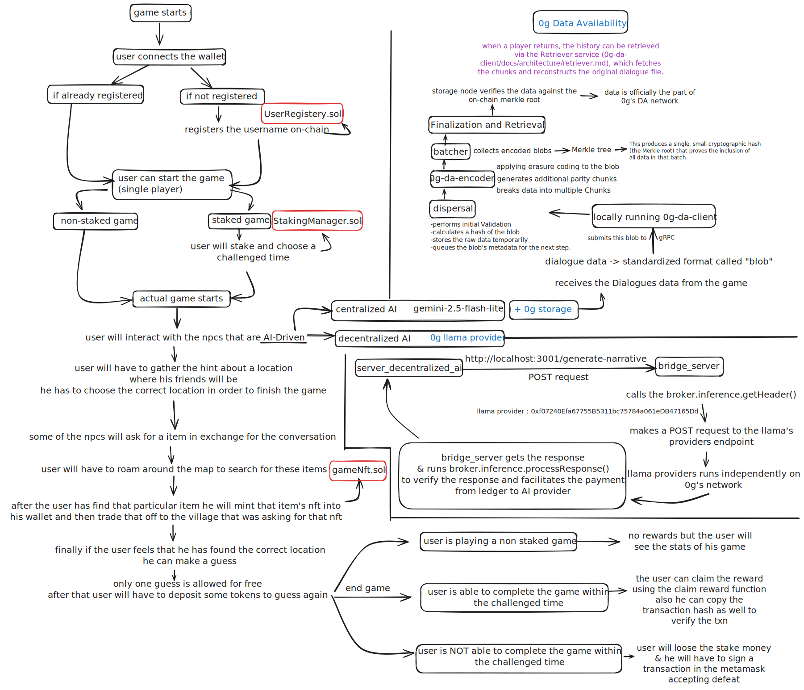

# Towns-whisper

Towns-whisper is an immersive 2D mystery-adventure game that fuses AI-driven storytelling with blockchain technology. Each playthrough offers a unique, dynamically generated narrative, challenging players to explore, trade, and compete to unravel secrets in order to rescue their lost friends.

## Storyline

A relaxing trip with friends takes a terrifying turn after a sudden accident. You awaken alone, disoriented, on the outskirts of a strange, mist-shrouded village. Your friends are missing.

Guided by a mysterious disembodied voice (powered by Text-to-Speech), you begin exploring the village. The locals are wary, their memories fragmented, and their secrets buried. To uncover the truth and save your friends, you must piece together clues, earn villagers’ trust, and make difficult choices before time runs out.

## System Architecture



## Use of 0G Stack

### Decentralized AI

The `bridge_server` is the core component of our decentralized AI integration. It acts as a broker between the game and the 0G compute network, enabling dynamic and verifiable narrative generation. Here's how it works:

1.  **On-Chain Ledger Management:** The server manages an on-chain compute ledger, ensuring that there are always sufficient funds to pay for AI inference requests. It can automatically top up the ledger if the balance falls below a certain threshold.
2.  **Provider Acknowledgment:** Before sending requests to an AI provider, the server acknowledges them on-chain, establishing a secure and trusted relationship.
3.  **Inference Request Handling:** When the game needs to generate a narrative, it sends a prompt to the `bridge_server`. The server then constructs a secure request and forwards it to a decentralized AI provider on the 0G network.
4.  **On-Chain Verification:** After receiving the AI-generated narrative, the server verifies the response on-chain. This ensures the integrity of the content and prevents tampering.

This decentralized approach to AI not only enhances the game's dynamism but also adds a layer of security and transparency that would be difficult to achieve with a traditional centralized AI service.

### 0G Storage

We use 0G's decentralized storage solution to persist player dialogue history, ensuring that it is both censorship-resistant and highly available. The storage implementation is split into two main components:

1.  **`0g_storage_service`:** This is a dedicated Node.js server that encapsulates all interactions with the 0G storage network. It uses the `@0glabs/0g-ts-sdk` to handle file uploads and downloads, and it manages a local map of wallet addresses to their corresponding dialogue history root hashes. This service exposes a simple REST API for saving and retrieving dialogue.
2.  **`server_centralized_0g_storage`:** This server acts as a client to the `0g_storage_service`. It provides a high-level API for the main application to interact with, abstracting away the complexities of the underlying storage mechanism. This separation of concerns makes the storage logic more modular and easier to maintain.

By using 0G storage, we can provide a more robust and resilient gaming experience, where players can be confident that their progress is securely stored and always accessible.

### 0g Data Availability (DA) Implementation

The 0G Data Availability layer ensures that critical game events are cryptographically secured, verifiable, and resilient against data loss or censorship. Our implementation creates an immutable audit trail of player actions that can be independently verified on-chain.

#### Architecture Overview

```
┌─────────────────────────────────────────────────────────────────────┐
│                    FRONTEND (React + Phaser)                        │
│  ┌──────────────────────────────────────────────────────────────┐  │
│  │  game/services/daService.js                                   │  │
│  │  • Fire-and-forget event logging                              │  │
│  │  • Non-blocking (game never pauses for DA)                    │  │
│  │  • Retrieval API for historical events                        │  │
│  └──────────────────────────────────────────────────────────────┘  │
└─────────────────────────────────────────────────────────────────────┘
                              │
                              │ HTTP POST (localhost:3002/da/disperse)
                              ▼
┌─────────────────────────────────────────────────────────────────────┐
│              0G STORAGE SERVICE (Node.js Express)                   │
│  ┌──────────────────────────────────────────────────────────────┐  │
│  │  storageManager.js                                            │  │
│  │  • Wraps game events with metadata (timestamp, description)  │  │
│  │  • Serializes to binary buffer                                │  │
│  │  • Manages gRPC communication with DA client                  │  │
│  │  • Tracks request_id → wallet mappings for retrieval         │  │
│  └──────────────────────────────────────────────────────────────┘  │
└─────────────────────────────────────────────────────────────────────┘
                              │
                              │ gRPC (disperseBlob) - port 51001
                              ▼
┌─────────────────────────────────────────────────────────────────────┐
│           0G-DA-CLIENT (Docker Container - Go Binary)               │
│  ┌──────────────────────────────────────────────────────────────┐  │
│  │  Disperser                                                     │  │
│  │  • Receives blob via gRPC (proto/disperser.proto)            │  │
│  │  • Validates blob size and format                            │  │
│  │  • Stores in memory DB for batching                          │  │
│  └──────────────────────────────────────────────────────────────┘  │
│  ┌──────────────────────────────────────────────────────────────┐  │
│  │  Batcher                                                       │  │
│  │  • Groups blobs every 3 seconds (configurable)               │  │
│  │  • Sends batch to encoder for cryptographic processing       │  │
│  │  • Builds Merkle tree from encoded chunks                    │  │
│  └──────────────────────────────────────────────────────────────┘  │
└─────────────────────────────────────────────────────────────────────┘
                              │
                              │ gRPC (EncodeBlob) - port 34000
                              │ host.docker.internal (Docker → WSL bridge)
                              ▼
┌─────────────────────────────────────────────────────────────────────┐
│           0G-DA-ENCODER (WSL Native Process - Rust Binary)          │
│  ┌──────────────────────────────────────────────────────────────┐  │
│  │  Encoding Service                                             │  │
│  │  • Applies Reed-Solomon erasure coding                       │  │
│  │  • Creates KZG polynomial commitments                        │  │
│  │  • Generates cryptographic proofs                            │  │
│  │  • Returns encoded chunks to DA client                       │  │
│  └──────────────────────────────────────────────────────────────┘  │
└─────────────────────────────────────────────────────────────────────┘
                              │
                              │ Encoded data + proofs returned
                              ▼
┌─────────────────────────────────────────────────────────────────────┐
│           0G-DA-CLIENT (Continued - Signing & Finalization)         │
│  ┌──────────────────────────────────────────────────────────────┐  │
│  │  Signer                                                        │  │
│  │  • Collects signatures from DA signers                        │  │
│  │  • Verifies signature threshold (quorum)                      │  │
│  └──────────────────────────────────────────────────────────────┘  │
│  ┌──────────────────────────────────────────────────────────────┐  │
│  │  Finalizer                                                     │  │
│  │  • Submits Merkle root to 0G blockchain                       │  │
│  │  • Waits for transaction finality (50 blocks)                │  │
│  │  • Confirms on-chain commitment                               │  │
│  └──────────────────────────────────────────────────────────────┘  │
└─────────────────────────────────────────────────────────────────────┘
                              │
                              │ Transaction to 0x857C...Aa9 (Entrance Contract)
                              ▼
┌─────────────────────────────────────────────────────────────────────┐
│                  0G BLOCKCHAIN (Newton Testnet)                     │
│  ┌──────────────────────────────────────────────────────────────┐  │
│  │  On-Chain Data Availability Contract                          │  │
│  │  • Stores Merkle root commitment                              │  │
│  │  • Timestamp and block number anchoring                       │  │
│  │  • Immutable proof of data availability                       │  │
│  └──────────────────────────────────────────────────────────────┘  │
└─────────────────────────────────────────────────────────────────────┘
```

#### Critical Game Events Logged to DA

We disperse the following events to ensure a complete, verifiable game history:

1. **Player Authentication**
   - New user registration
   - Returning user login sessions

2. **Game Lifecycle**
   - Single-player game start (with difficulty and staking details)
   - Multiplayer room creation
   - Player joining multiplayer rooms
   - Multiplayer game start (with full player roster)

3. **Economic Events**
   - Stake forfeiture (abandoned games)
   - Reward claims (with Hedera schedule ID)

4. **Multiplayer Coordination**
   - Room creation metadata
   - Player join events
   - Game initialization parameterss

#### Data Flow Example: Player Wins Game

1. **Frontend**: Player defeats final boss
   ```javascript
   daService.disperseCriticalEvent(
     { player: "0xABC...", outcome: "victory", time: 450 },
     "Player Victory",
     "0xABC...",
     "GAME_VICTORY"
   );
   ```

2. **Storage Service**: Wraps with metadata, sends via gRPC
   ```json
   {
     "timestamp": "2025-10-20T12:34:56Z",
     "description": "Player Victory",
     "data": { "player": "0xABC...", "outcome": "victory", "time": 450 }
   }
   ```

3. **DA Client**: Batches with other events
   ```
   Batch #1234: [Player Victory, Room Created, User Login]
   Merkle Root: 0xDEADBEEF...
   ```

4. **Encoder**: Applies erasure coding
   ```
   Original: 250 bytes → Encoded: 500 bytes (2x redundancy)
   Chunks: 10 pieces distributed to storage nodes
   ```

5. **Blockchain**: Merkle root committed
   ```
   Transaction: 0x789ABC...
   Block: 2,975,123
   Status: FINALIZED
   ```

6. **Result**: Returns `request_id` to frontend
   ```json
   {
     "result": "SUCCESS",
     "request_id": "3c66a548...81a9-31373..."
   }
   ```

#### Retrieval Flow

When a player returns, their history can be reconstructed:

```javascript
// 1. Get all request_ids for the player
const events = await daService.getPlayerEvents(walletAddress);
// Returns: { GAME_START: [...], GAME_VICTORY: [...], USER_LOGIN: [...] }

// 2. Retrieve specific event data
const victoryData = await daService.retrieveBlob(request_id);
// Returns: { player: "0xABC...", outcome: "victory", time: 450 }
```

## Screenshots

|                                       |                                       |
| ------------------------------------- | ------------------------------------- |
|  |  |
|  |  |
|  |  |

### Technology Stack

*   **Frontend (game):**
    *   Game Engine: **Phaser 3** (2D game framework)
    *   Framework: **React + Vite** (modern web frontend)
    *   Styling: **Tailwind CSS**
    *   Web3: **Ethers-compatible libraries** for wallet & contract interaction
*   **Backend (servers):**
    *   Framework: **FastAPI** (Python), **Express.js** (Node.js)
    *   AI: **Google Gemini** for narrative generation & conversational AI
    *   APIs: Supports both centralized and decentralized modes
*   **Blockchain (contracts):**
    *   Network: **EVM compatible chains**
    *   Smart Contracts: Written in **Solidity**

## Project Structure

```
Towns-whisper/
├── 0g_storage_service/      # Node.js server for 0G storage
├── assets/                  # Game assets, including images and SVGs
├── bridge_server/           # Node.js server bridging game client and blockchain
├── contracts_eth/           # Ethereum smart contracts and deployment scripts
├── game/                    # Web-based game client (React + Vite + Phaser 3)
├── server_centralized/      # Centralized backend server (FastAPI) - (Currently Ignored)
├── server_centralized_0g_storage/ # Centralized backend with 0G storage integration
└── server_decentralized_0g/ # Decentralized backend server (0g integration)
```

## Getting Started

### Prerequisites

*   Node.js (v16+)
*   npm or yarn
*   Foundry (for Ethereum smart contracts)
*   Python 3.9+

### Installation

1.  **Clone the repository with submodules:**
    ```bash
    git clone --recurse-submodules <repo-url>
    cd Towns-whisper
    ```

2.  **Install dependencies for each component:**
    ```bash
    # 0g Storage Server
    cd 0g_storage_service && npm install && cd ..

    # Bridge Server
    cd bridge_server && npm install && cd ..

    # Game
    cd game && npm install && cd ..

    # Centralized 0G Storage Server
    cd server_centralized_0g_storage && pip install -r requirements.txt && cd ..

    # Decentralized 0G Server
    cd server_decentralized_0g && pip install -r requirements.txt && cd ..
    ```

### Running the Game

1.  **Run the 0G Storage Server:**
    ```bash
    cd 0g_storage_service
    npm start
    ```

2.  **Run the Bridge Server:**
    ```bash
    cd bridge_server
    npm start
    ```

3.  **Run the Centralized 0G Storage Server:**
    ```bash
    cd server_centralized_0g_storage
    uvicorn main:app --reload
    ```

4.  **Run the Decentralized 0G Server:**
    ```bash
    cd server_decentralized_0g
    uvicorn main:app --reload
    ```

5.  **Run the Frontend:**
    ```bash
    cd game
    npm run dev
    ```

## Smart Contracts

### Deployed Addresses

*   **User Registry:** `0x5133fa99d718111fb6a708bee4ffe935fb529d1b`
*   **Game Items:** `0xf80c2f2ac5ed19f609071c06efd21eab686436f5`
*   **Staking Manager:** `0x0d6c4d4046cdf8ca49ffaae4cf10b6bf7f1d7dc9`
